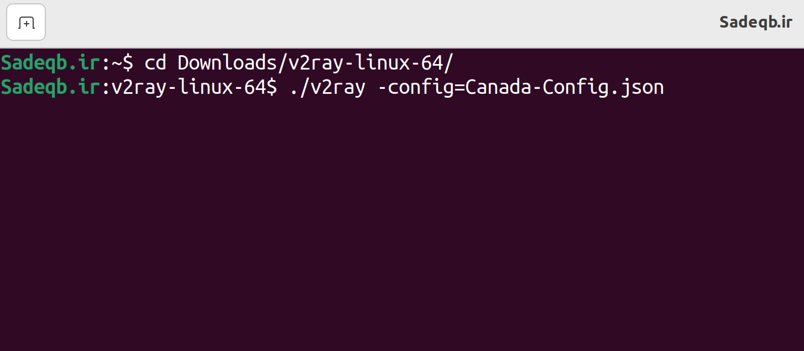
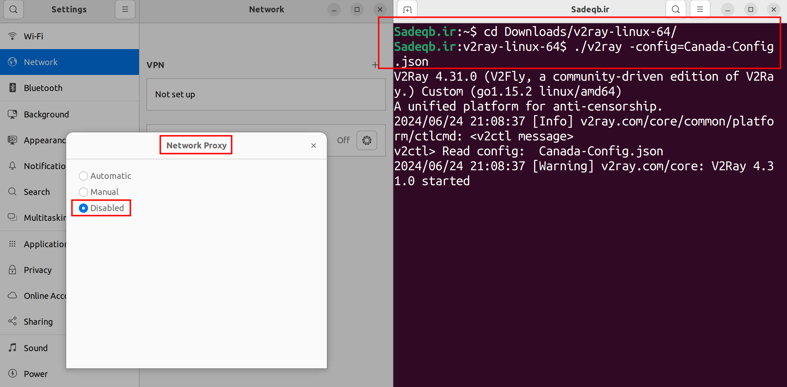
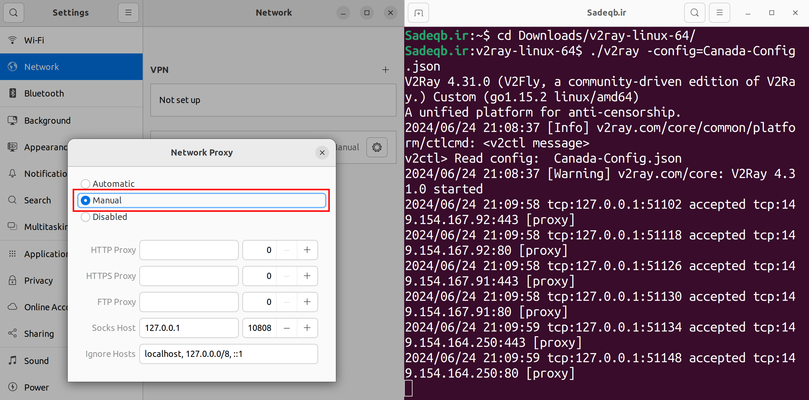
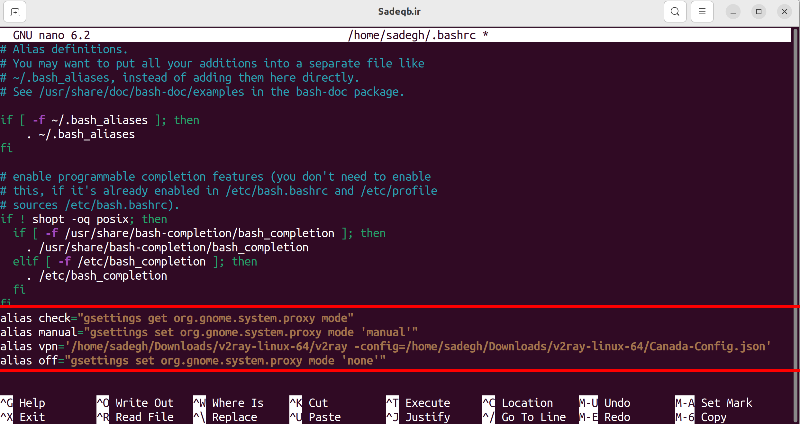
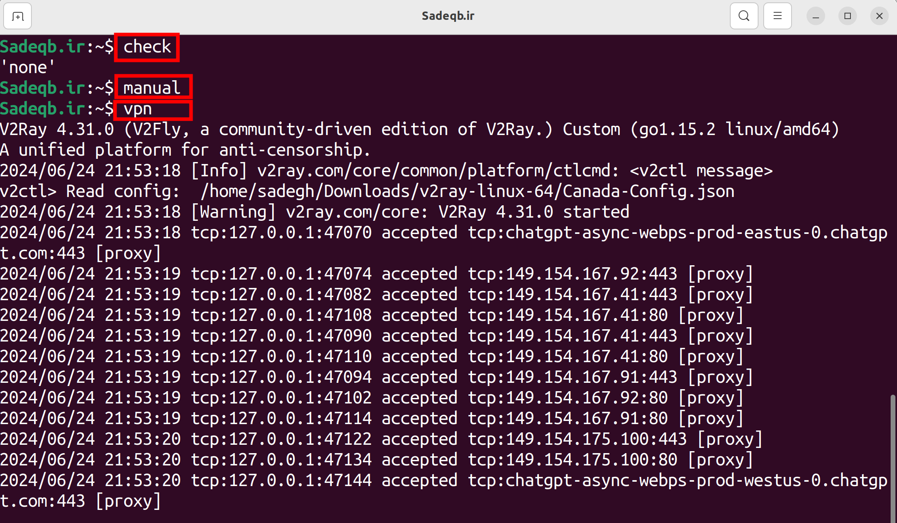

# VPN-for-Linux
When I initially transitioned to the Linux environment, I encountered significant confusion and difficulty in identifying a suitable VPN alternative to Windows. If you find yourself in a similar situation, this guide will provide clear instructions on how to install and configure V2Ray VPN on Linux with ease.

# Recommended VPN: V2Ray
For Linux users, I highly recommend V2Ray VPN and suggest not searching for alternative software. Follow the step-by-step instructions provided in [this guide](https://www.linuxbabe.com/ubuntu/set-up-v2ray-proxy-server) and ensure you configure your browser's proxy settings accordingly.

# Common Challenges
One challenge you may encounter is the need to disable the VPN at times. This requires switching your operating system's proxy settings from manual mode to disabled mode. Frequently toggling between these modes can become quite cumbersome. Additionally, launching the VPN and configuring it often necessitates repeatedly entering a lengthy command.

I will demonstrate how to streamline these tasks efficiently, allowing you to complete them within seconds.

# Standard Method

**Step 1: Navigating to the V2Ray Directory and Defining the Configuration File.**



**Step 2: Checking the network proxy status.**



**Step 3: Transitioning to Manual Mode and Enjoying Free Internet Access 😎**




When it is necessary to disable the VPN (e.g., to access internal websites), you must stop the V2Ray service and select "Disabled" mode in the system proxy settings. Over time, this process can become quite cumbersome. Let's explore ways to streamline this procedure for efficiency.

# Streamlined Method

**Step 1: Edit `.bashrc`**

Run this commond in your terminal:

```
nano ~/.bashrc
```

**Step 2: Add Aliases**

Paste the following lines at the end of the opened file:

```
alias check="gsettings get org.gnome.system.proxy mode"
alias vpn='/home/sadegh/Downloads/v2ray-linux-64/v2ray -config=/home/sadegh/Downloads/v2ray-linux-64/Canada-Config.json'
alias manual="gsettings set org.gnome.system.proxy mode 'manual'"
alias off="gsettings set org.gnome.system.proxy mode 'none'"
```

**Example:**



*don`t forget to save this file (ctrl+S) before exiting.*

# Testing the Streamlined Method

Now let's luanch V2Ray in 3 seconds🔮

- Check system proxy settings:

```
check
```

- if it is disabled, easily type "manual" to turn it on.

```
manual
```

- Luanch V2Ray:

```
vpn
```

**Example:**




- to turn V2Ray off, first quit by (ctrl+C) then type "off":

```
off
```

**Enjoy it! From now on, you can activate the VPN in no time.**


